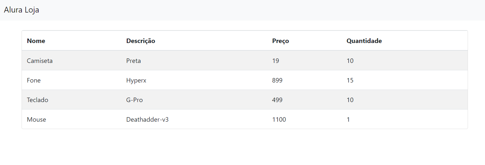

# Lojinha de Artigos Variados

Aplicação Web de uma loja utilizando Golang como backend.

| 🪧 Vitrine.Dev |                                                           |
| -------------- | --------------------------------------------------------- |
| ✨ Nome        | **Lojinha**                                               |
| 🏷 Tecnologias  | go, html, bootstrapcdn, postgressql                       |
| 🚀 URL         | https://url-deploy.com.br                                 |
| 🔥 Desafio     | https://cursos.alura.com.br/course/go-lang-web/task/58837 |

<!-- Inserir imagem com a #vitrinedev ao final do link -->

## Detalhes do projeto

Projeto ainda em estágio inicial...
